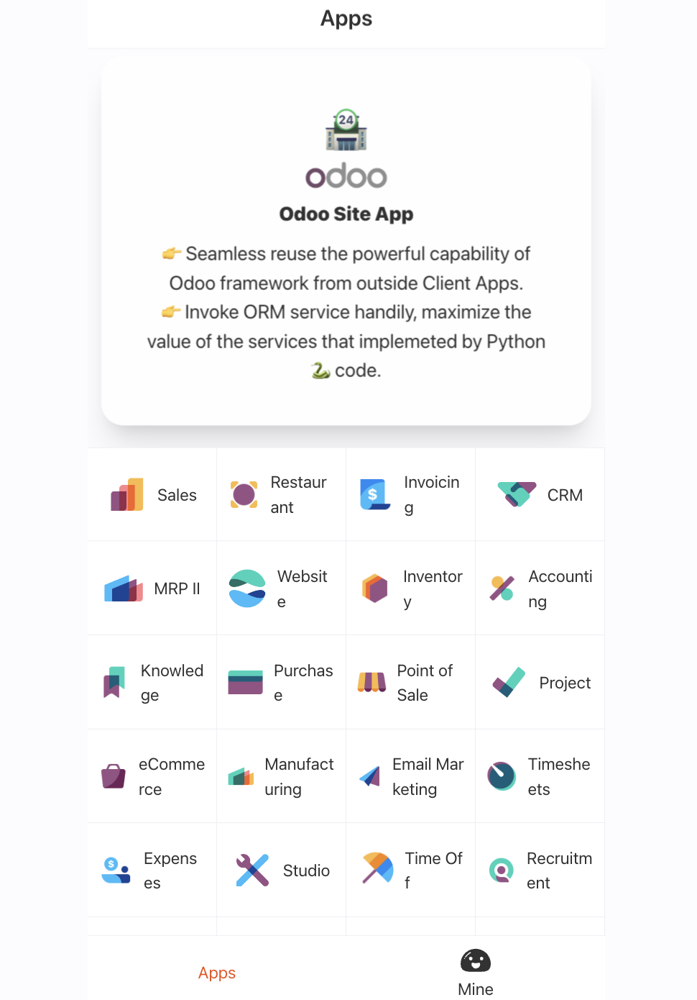

<div align="center">
  <a href="https://github.com/ixkit/odoo-site-app">
    <span style="font-size:50px;">🏪</span>
  </a>
   <br>
  <a href="https://github.com/ixkit/odoo-site-app">
    
  </a>
</div>
 

<h1 align="center">Odoo Site App</h1>


## Purpose

Odoo Site App demo how to use [Odoo WebClient 📡](https://github.com/ixkit/odoo-webclient) from frontend application, through the Odoo WebClien 📡, seamless reuse the powerful capability of Odoo framework from outside Client Apps, invoke [ORM service](https://www.odoo.com/documentation/17.0/developer/reference/frontend/javascript_reference.html#services) handily, maximize the value of the services that implemeted by Python🐍 code.

## Usage Odoo WebClient 📡
  - Install odoo-webclient
  ```
    pnpm i odoo-webclient

  ```
  - Key steps
    - Setup ClientManager
      [initOdooWebClient](./src/main.ts#initOdooWebClient) 
      
    - Login
      [loginWithOdooWebClient](./src/api/system/user.ts#loginWithOdooWebClient)

    - Invoke orm service call Python method fetch the apps moudles data
      [fetchApps](./src/views/apps/index.vue#reloadData)

    More detail usage find from [Odoo WebClient 📡](https://github.com/ixkit/odoo-webclient)

## Screen Snapshot
<div>

</div>


## Backend Services required

  - [Odoo-Site 🏪](https://apps.odoo.com/apps/modules/17.0/site)  
    Odoo Site expose the Odoo WebClient to Frontend Apps smoothly,seamless reuse the powerful capability of Odoo framework from outside Client Apps .
  - [Odoo](https://github.com/odoo/odoo)  
    The Odoo framework To Grow Your Business.

## Tech Stacks & Dependencies
- [Odoo-WebClient📡](https://github.com/ixkit/odoo-webclient)
- [RxJS](https://github.com/ReactiveX/rxjs)
- [Vite](https://cn.vitejs.dev/) 
- [Vue3](https://v3.vuejs.org/)
- [Vant4](https://youzan.github.io/vant/v4/#/zh-CN) 
- [Pinia](https://pinia.vuejs.org/) 
- [TypeScript](https://www.typescriptlang.org/) 
- [Vue-Router-Next](https://router.vuejs.org/)
- [ES6+](http://es6.ruanyifeng.com/)
- [vue3-vant4-mobile](https://github.com/ixkit/vue3-vant4-mobile)


## Appendix

## Use this skeleton

```bash
# clone source code
git clone https://github.com/ixkit/odoo-site-app.git

# install dependencies
cd odoo-site-app
pnpm install

# force update dependence
pnpm run clean:cache

# run with dev mode, should configure the setting VITE_PROXY in file ".env.development",
# set the right address of odoo instance
pnpm dev

# biuld
pnpm build
```

<!-- ## Screen Snapshot
<div>

</div>
<table>
  <tr>
    <td>
    </td> 
  </tr> 
</table>

 <details> 
</details> 
  -->

## 维护者

[@ixkit](https://github.com/ixkit)

## LICENSE

[MIT](https://en.wikipedia.org/wiki/MIT_License)
